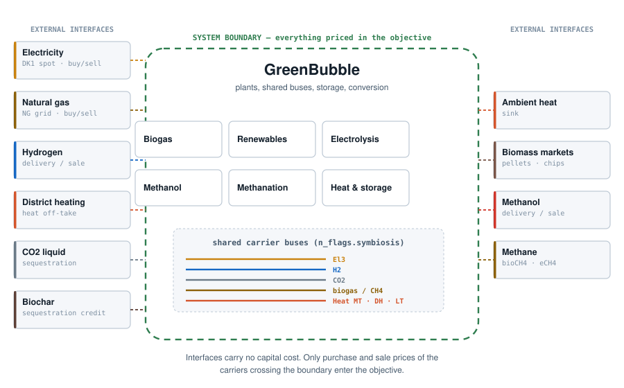
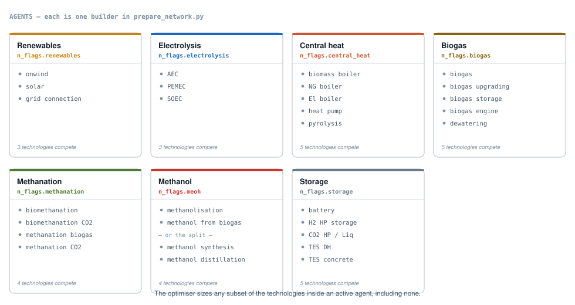
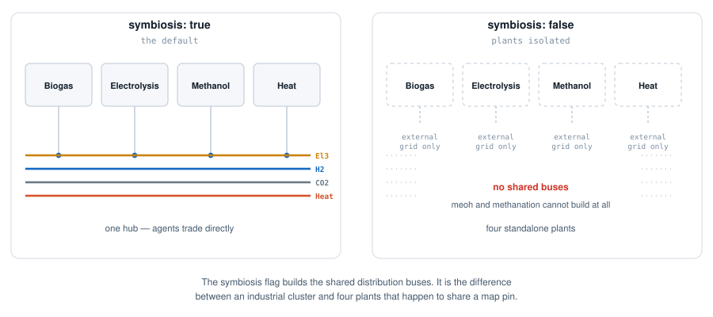

.. SPDX-FileCopyrightText: Contributors to GreenBubble
.. SPDX-License-Identifier: CC-BY-4.0

.. _model-approach:

Model Approach
==============

:doc:`design` covers what GreenBubble inherits from PyPSA. This page covers the
choices that make it GreenBubble: how the site is bounded, how it is divided into
agents, what connects them, and how far the physics is taken.

----

.. _multi-energy:

Multi-energy representation
---------------------------

GreenBubble represents an industrial cluster as a multi-energy network: several
carriers modelled at once, with conversion between them as the object of study
rather than an afterthought.

Each carrier has its own buses, and a plant that consumes one and produces
another is a single multi-port link across them. The carriers are:

.. list-table::
   :header-rows: 1
   :widths: 22 20 58

   * - Carrier
     - Unit
     - Role
   * - Electricity
     - MW
     - On-site renewables, grid import and export, and every electrical load.
   * - Hydrogen
     - MW (LHV)
     - Produced by electrolysis, consumed by methanol and methanation, or sold.
   * - CO₂
     - t/h
     - Separated by biogas upgrading; a feedstock, not only an emission.
   * - Biogas and methane
     - MW (LHV)
     - Raw biogas, upgraded biomethane, and synthetic methane, tracked apart.
   * - Methanol
     - MW (LHV)
     - The product of two competing routes.
   * - Heat
     - MW
     - Three temperature circuits, not one: MT, DH and LT.
   * - Biomass
     - MW / t
     - Wet biomass, pellets and digestate through the drying and pyrolysis chain.

Modelling heat as three circuits rather than one carrier is the choice that costs
the most and buys the most. It means a reactor's waste heat can only serve a
demand at or below its own temperature, which is the difference between a
plausible integration figure and an optimistic one.

----

.. _system-boundary:

The system boundary
-------------------

Everything the model prices sits inside one boundary. Outside it are the markets
and sinks the site trades with.

   The bubble and its interfaces. Only what is inside carries capital cost.

The site meets the outside world at these interfaces:

.. list-table::
   :header-rows: 1
   :widths: 24 30 46

   * - Interface
     - Direction
     - What it represents
   * - Electricity
     - buy and sell
     - The DK1 spot market, at an hourly price series, with tariffs applied on
       top and an export cap.
   * - Natural gas
     - buy and sell
     - The gas grid: a purchase price for the boilers, and a sale route for
       biomethane and e-methane at their own premiums.
   * - Hydrogen
     - sell
     - Delivery to an off-taker, as an annual target or at a price.
   * - Methanol
     - sell
     - As above, and the destination of both methanol routes.
   * - District heating
     - sell
     - Surplus heat off-take, disabled by default (``options.DH``).
   * - CO₂ liquid
     - out
     - Liquefied CO₂ leaving for sequestration, with an optional credit.
   * - Biochar
     - out
     - Carbon leaving as solid, with an optional sequestration credit.
   * - Ambient heat
     - sink
     - Where heat too cold to be useful goes. Unpriced, unlimited.
   * - Biomass markets
     - buy
     - Pellets, wood chips and digestible biomass.

**Interfaces carry no capital cost.** There is no charge for the existence of a
grid connection to the market, or of a pipeline to an off-taker. What enters the
objective is only the *price of the carrier crossing the boundary* — electricity
bought, methanol sold, gas purchased.

This is a deliberate accounting choice, and it is what makes the results readable:
the objective is the cost of the bubble, so a change in it is a change in
something the project could actually build or operate. The one exception is
internal: the on-site electrical connection has a real capacity and a real cost,
because the site must size it — see :ref:`grid-connection-capex`.

----

.. _agents:

Agents
------

The model is organised into **agents**: broad categories of plant, each defined
by a function rather than by a technology. They are switched on and off
individually by the ``n_flags`` block in ``config.yaml``, and each corresponds to
one builder function in ``scripts/prepare_network.py``.

An agent is the tier-1 object of the model. It is self-standing: it owns its
plant-local buses and components, and it must leave the network feasible whether
or not any other agent was built.

   Each agent holds several technologies that perform the same function. The
   optimiser sizes any subset, including none.

**Inside an agent, technologies compete.** This is the point of the structure.
``electrolysis`` is not "an electrolyser" — it offers alkaline, PEM and solid
oxide, with different capital costs, efficiencies, and outlet pressures, all
producing into the same hydrogen header. The optimiser picks. The same is true of
methanol, where two different chemistries feed one collection bus, and of heat,
where four boilers and a heat pump bid against each other hour by hour.

What each agent connects to
~~~~~~~~~~~~~~~~~~~~~~~~~~~

.. list-table::
   :header-rows: 1
   :widths: 17 27 24 32

   * - Agent
     - Shared buses used
     - External interfaces
     - Products
   * - ``biogas``
     - biogas, CO₂, electricity, heat
     - biomass markets, gas grid
     - methane
   * - ``renewables``
     - electricity
     - electricity market
     - —
   * - ``electrolysis``
     - electricity, H₂, heat
     - electricity market
     - hydrogen
   * - ``meoh``
     - H₂, CO₂, biogas, electricity, heat
     - —
     - methanol
   * - ``methanation``
     - H₂, CO₂, biogas, heat
     - gas grid
     - methane
   * - ``central_heat``
     - electricity, heat, gas
     - gas grid, biomass markets, DH, biochar
     - —
   * - ``storage``
     - electricity, H₂, CO₂, heat
     - —
     - —
   * - ``symbiosis``
     - *builds them all*
     - —
     - —

The technologies inside each agent are described in :doc:`technologies`.

.. _symbiosis-network:

Symbiosis is what makes it a hub
~~~~~~~~~~~~~~~~~~~~~~~~~~~~~~~~

The ``symbiosis`` flag builds the shared distribution buses — electricity,
hydrogen, CO₂, biogas and the three heat circuits. Without it, every agent can
still trade with the external interfaces, but not with its neighbours.

   With ``symbiosis`` the plants form one hub; without it they are separate
   projects that happen to share a site.

Two agents cannot exist without it at all. ``meoh`` needs hydrogen from the
electrolyser and CO₂ from the upgrader; ``methanation`` needs the same. Both
check for ``electrolysis``, ``biogas`` **and** ``symbiosis`` before building
anything, and return an empty component set if any is missing. ``renewables`` is
gated differently — it needs ``symbiosis`` *and* at least one on-site consumer,
so that a wind farm with no customer cannot be built purely to export.

**Any combination of flags is a valid run.** The dependency rules above resolve
first, and a blocked agent simply contributes nothing; infeasibility, if it
comes, comes from the targets and constraints rather than from the flag
combination itself. The resolution logic is ``network_dependencies()``.

----

.. _additional-constraints:

Additional constraints
----------------------

On top of the standard PyPSA constraints listed in :doc:`design`, GreenBubble
adds four of its own. They are built in ``scripts/helpers.py`` and added to the
Linopy model before solving.

.. list-table::
   :header-rows: 1
   :widths: 30 70

   * - Constraint
     - What it enforces
   * - ``add_max_RE_sales_constraint``
     - Electricity exported to the grid ≤ ``max_RE_to_grid`` × total renewable
       electricity consumed on site. Stops the model from becoming a wind farm
       with a chemical plant attached.
   * - ``add_grid_connection_shared_capacity_constraint``
     - Import and export capacity are the same physical connection, so their
       capacities are forced equal and paid for once. See
       :ref:`grid-connection-capex`.
   * - ``add_custom_constraints_stores``
     - Power-to-energy ratios on stores: a charger's capacity is tied to the
       store's size through ``min_max_hours``, so a battery cannot be given
       unlimited power for free.
   * - RFNBO compliance
     - Optional additionality and temporal-correlation limits on grid
       electricity used for electrolysis. See :ref:`methods-rfnbo`.

----

.. _grid-connection-capex:

Modelling the electrical grid interface
------------------------------------------------------

The site connects to the external DK1 grid in two directions: import (one
``DK1_to_El_{agent}`` link per on-site agent, e.g. ``DK1_to_El_electrolysis``)
and export (``El3_to_DK1``, priced at real spot prices). Physically these
share one connection asset, so the model prices it as one shared capacity
rather than paying for import and export capacity separately:

- Every agent's import branch draws from a single bus, ``"ElDK1 buy bus"``,
  fed by one extendable link, ``"DK1_to_ElDK1_buy"`` (built in
  ``add_local_el_connections``, ``scripts/prepare_network.py``). This link
  alone carries the "electricity grid connection" capital cost; every branch
  from ``"ElDK1 buy bus"`` to an agent's local bus has ``capital_cost = 0``
  and keeps its own ``marginal_cost`` (purchase price), so per-agent
  operating-cost reporting is unaffected — only capital cost moved.
- When both the shared import link and ``El3_to_DK1`` exist for a given
  ``n_flags`` configuration, ``build_network()`` zeros the export link's own
  capital cost and flags the network (``n.meta["consolidated_grid_connection"]
  = True``) so a custom constraint,
  ``add_grid_connection_shared_capacity_constraint`` (``scripts/helpers.py``),
  ties the two links' ``p_nom`` together — one equality constraint, not one
  per snapshot, since each link's own native PyPSA bound already caps its
  hourly dispatch once the two ``p_nom`` variables are equal. Only one
  physical capacity is ever paid for.
- If a configuration has only one side (e.g. a pure-import site with no
  export capability, or a fully self-sufficient renewables site that never
  buys from the grid), there is nothing to share — that link's own capital
  cost is left untouched, and the constraint silently skips (same defensive,
  never-raise style as :func:`add_max_RE_sales_constraint`).
- For reporting, ``reallocate_grid_connection_capex`` (``scripts/helpers.py``,
  called from ``snakemake_plot.py`` after the network is solved) splits the
  shared link's total capex back onto the individual import/export links, in
  proportion to each link's share of flow at the year's peak-usage hour(s) —
  see :ref:`shared grid-connection capex <payback-cost-allocation>` in :doc:`economics` for the method. This
  is a reporting-only, in-memory step; it never touches the optimisation.

----

.. _greenfield-brownfield:

Greenfield and brownfield
-------------------------

Whether an asset already exists is set per technology in ``n_config``, not
globally. Three parameters control it:

.. list-table::
   :header-rows: 1
   :widths: 30 14 14 42

   * - ``initial capacity``
     - ``expansion``
     - ``rif``
     - Meaning
   * - 0
     - ``true``
     - 0
     - Pure greenfield: build from nothing.
   * - > 0
     - ``false``
     - 0
     - Existing asset, fully depreciated. Sunk cost, no annual charge.
   * - > 0
     - ``false``
     - > 0
     - Existing asset still being paid for. Charged ``rif`` of its original
       investment.
   * - > 0
     - ``true``
     - any
     - Existing capacity plus the option to expand.

Existing capacity is added as a separate component with an ``EXI_`` prefix, so
it can be told apart from new build in every result. Its capital cost is looked
up at its own ``construction_year`` rather than at the investment year, which
matters for assets built when the technology cost was different. The economics
are in :doc:`economics`.

----

.. _process-integration:

Process integration
-------------------

GreenBubble takes process integration further than a typical energy-system model,
but not as far as a process simulator. It is worth being explicit about where the
line sits.

**What is represented.** Every stream in the model has a declared physical state
— fluid, temperature, pressure — held in ``p_config`` and separate from the
techno-economic magnitudes in ``technology-data``. Because a state is declared
rather than assumed, a compressor's duty can be computed from its actual inlet
and outlet conditions, and waste heat can only be delivered to a circuit it is
hot enough to serve.

**What is not.** Heat integration is *not* a heat-exchanger network. There is no
pinch analysis and no matching of individual hot and cold streams. Instead heat
is carried by a small number of pressurised hot-water circuits, each defined by a
temperature band:

.. list-table::
   :header-rows: 1
   :widths: 22 20 20 38

   * - Circuit
     - T range [°C]
     - P [bar]
     - Typical role
   * - ``Heat MT``
     - 140 – 180
     - 12
     - Process steam duty: reboilers, reactor preheat.
   * - ``Heat DH``
     - 90 – 140
     - 6
     - District heating, and the useful part of compressor aftercooling.
   * - ``Heat LT``
     - 50 – 90
     - 3
     - Low-grade heat, and the floor that cooling duties reject to.

The tiers are **floors**: a stream may be delivered to any circuit whose minimum
temperature it exceeds, so heat degrades downward but never upward. The number of
circuits and their temperature bands are configuration, not code — add or retune
them in ``p_config`` and the assignment follows.

The consequence to keep in mind when reading heat results: a duty is placed in
one circuit by a single temperature cut, so a stream spanning two bands
contributes wholly to one of them. ``scripts/heat_bands.py`` generalises this to
contiguous bands, but the compressor code does not use it yet. See
:doc:`guide_process_streams`.

----

.. _physics-based:

Physics-based calculations
--------------------------

Two quantities in the model are not catalogue numbers but calculated
thermodynamics, using `CoolProp <http://www.coolprop.org/>`_ for real fluid
properties.

**Compressor duty.** Electricity and waste heat are computed stage by stage from
the declared inlet and outlet states: isentropic work from enthalpy and entropy,
a discharge-temperature cap that sets the number of stages, intercooling between
them. Pure fluids are looked up by name; biogas is handled as a real CH₄/CO₂
mixture.

**Cooling duty.** The heat rejected after each stage is integrated at constant
pressure and split by temperature between the ``Heat DH`` and ``Heat LT``
circuits, so a compressor is a component that buys electricity and sells two
grades of heat.

Both are evaluated **before the optimisation runs**, in
``scripts/technology_inputs.py``, and enter the LP as fixed coefficients on the
relevant links. The optimiser therefore sizes and dispatches a compressor whose
efficiency was set by physics rather than by assumption — but it cannot trade off
pressure levels, because those are an input. Changing a pressure in ``p_config``
changes the coefficients and requires a re-solve.

The method, the parameters and where each sits in the model are documented under
:ref:`technologies-compression`.
